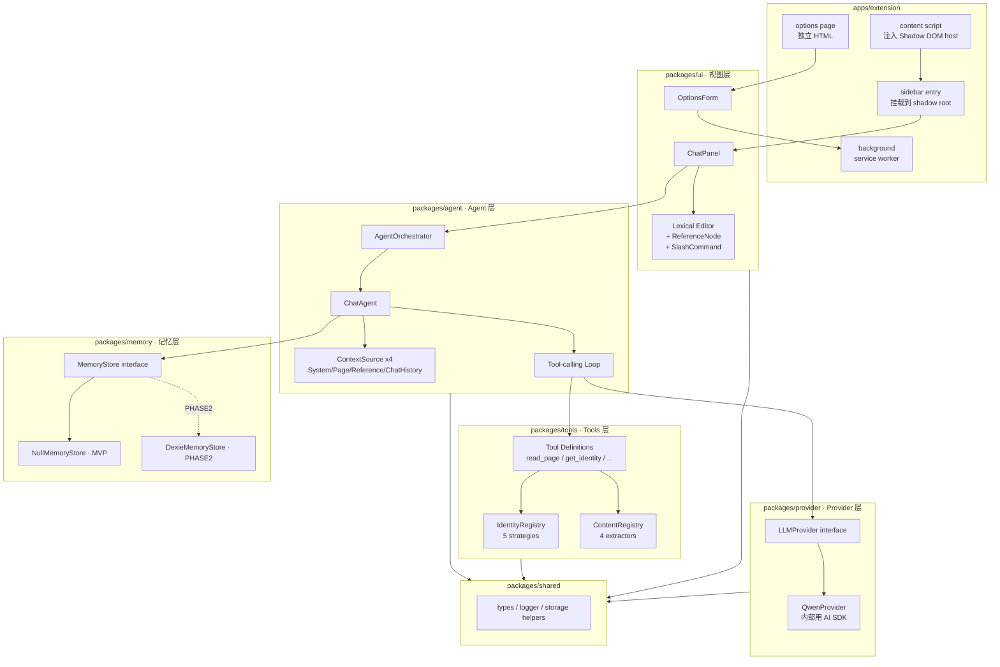

## 产品概览

一款面向在线学习场景的 Chrome / Edge 浏览器扩展——**智能阅读助手（Doc Assistant）**。用户在任意网页（尤其是文档/文章类页面）阅读时，可通过右侧吸附的对话框直接就当前文章与大模型对话，无需切换窗口或平台，且对话具备页面上下文感知能力。

## 核心特性（MVP v0.1）

- **侧边对话框**：content script 注入的右侧悬浮面板，支持折叠/展开、宽度拖拽、样式隔离，不污染宿主页面。
- **流式对话**：接入千问（Qwen）大模型，支持流式输出与思考过程（reasoning_content）展示。
- **页面内容理解**：自动识别当前文章身份（URL 参数 / OG / JSON-LD / 标题 / URL 兜底五级策略）并提取正文（Readability / 语义化标签 / 选区 / 全文兜底四级提取器），作为对话上下文自动注入。
- **划词引用**：在页面划选文本后弹出迷你工具条，点击「引用」即可以可视化 tag 的形式插入到输入框，对话时作为精确引用发送给模型。
- **斜杠命令**：输入框支持 `/` 命令面板，MVP 提供 `/new` 清空当前窗口对话上下文（不影响记忆层）。
- **独立配置页**：扩展独立页面（`chrome-extension://<id>/options.html`），Ant Design 表单配置 API Key、模型、baseURL 等，按服务商切换表单。

## 架构预留（MVP 不落地，接口就位）

- 记忆层（remember / recall）、OCR 策略、截图工具、多 Agent 协作（Checker Agent）、域名级自学习 DSL 提取器、云端同步 —— 均在 `docs/ROADMAP.md` 详细规划，代码内留 PHASE2/PHASE3 锚点。

## 非目标（MVP 不做）

- 历史会话列表 UI、新建会话按钮（由 `/new` 命令 + 未来记忆层召回替代）
- 任何持久化存储（刷新即丢是预期行为）
- 向量检索、OCR 识图、实时主动提醒、多模态、云同步

## 一、技术栈选型

| 维度 | 选型 | 说明 |
| --- | --- | --- |
| 目标浏览器 | Chrome / Edge（Manifest V3） | 不兼容 Firefox/Safari |
| 语言 | TypeScript 5.x | 全仓库严格模式 |
| 前端框架 | React 18 | 对话面板与配置页统一技术栈 |
| UI 组件库 | Ant Design 5.x | 配置页主力；对话框内按需使用 |
| 样式方案 | styled-components 6.x | 挂载到 Shadow DOM（StyleSheetManager 指定 target） |
| 富文本输入 | Lexical（Meta） | 自定义 `ReferenceNode`（DecoratorNode）承载引用 tag；`TypeaheadMenuPlugin` 实现 `/` 命令 |
| 构建工具 | Vite 5 + `@crxjs/vite-plugin` | MV3 扩展打包、HMR、多入口 |
| 包管理 | pnpm 9 + workspace | monorepo |
| LLM 协议适配（仅 Provider 层内部） | Vercel AI SDK (`ai` + `@ai-sdk/openai`) | 仅用于 HTTP/SSE/tool-calling 协议适配；Agent 层不得 import |
| 首个 Provider | 千问（Qwen，OpenAI 兼容端点） | 支持 `enable_thinking` / `reasoning_content` |
| 文章正文提取 | `@mozilla/readability` | Firefox Reader View 同款算法 |
| Schema 校验 | zod | 配置表单与 tool 参数校验 |
| 单元测试 | Vitest + happy-dom | 覆盖页面提取工具 |
| 代码规范 | ESLint + Prettier + Conventional Commits（中文 message） | 直接在 main 上连续 commit |


## 二、实现策略与关键决策

### 2.1 分层解耦：四层架构严格映射到 monorepo 分包

对应产品文档要求的 Provider / Agent / 记忆 / 视图 四层，加上 Tools 与 Shared 共 6 个 packages + 1 个 app。**依赖方向严格单向**：`extension → ui → agent → provider / tools / memory → shared`。Agent 层**禁止 import `ai` / `@ai-sdk/openai`**，只依赖 `LLMProvider` 接口，确保未来替换 AI SDK 零成本。

### 2.2 Provider 层：薄封装 + 业务语义归一化

`QwenProvider` 内部调用 `@ai-sdk/openai` 的 `streamText`，通过 `providerOptions` 透传千问专属字段 `enable_thinking`，并在流处理中把各类 chunk（text-delta / reasoning-delta / tool-call / finish）归一化为自定义的 `ChatChunk` 联合类型暴露给 Agent 层。千问的 `reasoning_content` 字段映射到 `ChatChunk.reasoning`。这样 Agent 侧看到的始终是稳定契约，不受 AI SDK 版本漂移影响。

### 2.3 Agent 层：ContextSource 抽象 + 自研 Loop

核心抽象是 `ContextSource`（按 priority 组装 LLM prompt 的各个段落）而非"直接喂聊天记录"。每个 Agent 持有一组 `ContextSource[]`：MVP 注册 System/Page/Reference/ChatHistory 四个；Phase 2 追加 LongTermMemory/RelevantMemory/SessionSummary 三个。Agent Loop 是经典的"调 LLM → 若有 tool_call 则执行 tool → 把结果回灌 messages → 继续"while 循环，纯手写约 50 行，不依赖任何编排框架。

### 2.4 Tools 层：双 Pipeline 页面提取 + 可注册 Registry

- **Identity Pipeline**（文章身份识别）：5 个内置策略按 priority 尝试，命中即返回；产出 `{ id, title, url, source }`，用于会话绑定。
- **Content Pipeline**（正文提取）：4 个内置提取器，Readability 为主力。
- 两个 Pipeline 共用 `Registry` 模式，暴露 `register(strategy)` 与 `priority` 字段 —— Phase 2 的域名级 DSL 识别器作为一个高优先级 extractor 注入即可，**不改任何现有代码**。
- 这些能力同时作为 Agent 的 Tool 暴露：`read_page_content` / `get_page_identity` / `get_selection_text`。

### 2.5 视图层：Shadow DOM 注入 + 样式完全隔离

content script 在目标页面 `<body>` 插入 host `<div id="doc-assistant-root">`，调用 `attachShadow({ mode: 'open' })`，React 应用挂载至 shadow root。styled-components 通过 `<StyleSheetManager target={shadowRoot}>` 将样式注入 shadow 内部。折叠时收成右边缘小图标（44px），展开时面板（默认 420px，可拖拽）。配置页走 `options_ui { open_in_tab: true }`，独立 HTML，不走 Shadow DOM。

### 2.6 记忆层：MVP 只留接口

`MemoryStore` 接口定义 `remember(record)` / `recall(query)` 两个核心动词，`NullMemoryStore` 所有方法 no-op。Agent 构造时注入 `NullMemoryStore`，代码路径完整、数据为空。Phase 2 实现 `DexieMemoryStore` 替换注入即可。**不装 dexie，不装任何向量库**。

### 2.7 性能与可靠性要点

- **流式渲染**：使用 React 18 `useSyncExternalStore` 订阅流式 ChatChunk，避免频繁 setState 抖动；思考过程单独折叠块。
- **Readability 副本解析**：`document.cloneNode(true)` 后再解析，防止污染页面 DOM。
- **划词节流**：`mouseup` 后 150ms 防抖再计算选区位置。
- **Lexical 懒加载**：`@lexical/react` 仅在 sidebar bundle 引入（约 22KB gzip）。
- **Shadow DOM 事件**：React 在 shadow 内的事件需通过 `createRoot` 自动处理合成事件；注意 portal 类组件（antd Modal/Select）需设置 `getPopupContainer` 到 shadow root。
- **Provider AbortSignal**：用户中断对话时向 AI SDK 传 `AbortController.signal`，清理未完成的 SSE 连接。

## 三、执行约束（防退化）

- Agent 层代码中严禁出现 `from 'ai'` / `from '@ai-sdk/*'` 导入（ESLint 规则 `no-restricted-imports` 强约束）。
- MVP 里 `packages/memory` 的 `package.json` 不得出现 `dexie`；`packages/tools` 的 `package.json` 不得出现 `tesseract.js`。
- 所有"本期不做"的能力对应位置必须有 `// PHASE2: 见 docs/ROADMAP.md §x.y` 注释锚点。
- 日志统一通过 `packages/shared/src/logger.ts` 封装（基于 `console.*`，分 level，带 scope 前缀 `[provider]` `[agent]` 等），避免裸 console.log 散布；**严禁打印 apiKey 与完整用户消息内容**（只打 sha1 或长度）。
- 安全：API Key 仅存 `chrome.storage.local`，不进 IndexedDB、不写日志；manifest 权限最小化（`storage` + `activeTab` + `scripting`，不申请 `<all_urls>` host permission，改用 `activeTab` 按需）。

## 四、架构图



## 五、目录结构

### 5.1 总览

从零开始搭建 pnpm monorepo；下面仅列出 MVP 需要创建的所有文件（不含 `node_modules` / `dist` / lockfile / IDE 配置）。每个文件都带详细职责注释。

```
doc-assistant/
├── package.json                          # [新增] 根 package，声明 workspaces 脚本（dev / build / build:ext / test / lint / format），pnpm 版本约束
├── pnpm-workspace.yaml                   # [新增] 声明 packages/* 与 apps/*
├── tsconfig.base.json                    # [新增] 严格模式 TS 基础配置，strict/noUncheckedIndexedAccess/exactOptionalPropertyTypes，各子包继承
├── tsconfig.json                         # [新增] 根 tsconfig references，指向各子包
├── .eslintrc.cjs                         # [新增] ESLint 规则；关键：在 packages/agent 下禁止 import 'ai' 与 '@ai-sdk/*'
├── .prettierrc                           # [新增] Prettier 规则
├── .editorconfig                         # [新增] 编辑器一致性
├── .gitignore                            # [新增] 忽略 node_modules / dist / .turbo / .DS_Store / *.log
├── .npmrc                                # [新增] shamefully-hoist=false、prefer-workspace-packages=true
├── README.md                             # [修改] 替换为项目介绍、快速开始、构建/加载扩展步骤
│
├── docs/
│   └── ROADMAP.md                        # [新增] Phase 2+ 详细规划文档，包含：域名级 DSL 提取器（动机/DSL Schema 草案/触发缓存策略/降级/禁止 eval）、记忆层落地（Dexie schema/remember&recall/向量/话题聚类）、OCR 策略模式、Checker Agent+实时提醒、云端同步；末尾附"给下次 AI 协作者的指令"
│
├── apps/
│   └── extension/                        # Chrome 扩展宿主
│       ├── package.json                  # [新增] 依赖 ui/agent/provider/tools/memory/shared；devDep @crxjs/vite-plugin、vite、@types/chrome
│       ├── tsconfig.json                 # [新增] 继承 base，jsx: react-jsx
│       ├── vite.config.ts                # [新增] 使用 @crxjs/vite-plugin，传入 manifest.json；多入口：background / content / sidebar / options
│       ├── manifest.json                 # [新增] MV3 manifest：permissions=storage,activeTab,scripting；action.default_title；options_ui.open_in_tab=true；background.service_worker；content_scripts 匹配 <all_urls>
│       ├── index.html                    # [新增] 仅用于开发模式占位
│       ├── public/
│       │   ├── icon-16.png               # [新增] 扩展图标（占位纯色图）
│       │   ├── icon-48.png               # [新增]
│       │   └── icon-128.png              # [新增]
│       └── src/
│           ├── background/
│           │   └── index.ts              # [新增] service worker：监听 action.onClicked 切换 sidebar；chrome.runtime.onMessage 路由；contextMenu "打开配置页"；在非 activeTab 下通过 scripting 注入 content 兜底
│           ├── content/
│           │   ├── index.ts              # [新增] content script 入口：创建 host div、attachShadow、挂载 React；监听划词 mouseup+selectionchange→弹 mini 工具条；消息桥接到 sidebar
│           │   ├── shadow-host.ts        # [新增] 封装 Shadow DOM 构建（host div、style container、React root container）
│           │   └── selection-toolbar.tsx # [新增] 划词后的迷你工具条（"引用"按钮），通过 postMessage 到 sidebar
│           ├── sidebar/
│           │   ├── index.tsx             # [新增] 侧边栏 React 应用入口，挂载 ChatPanel；通过 StyleSheetManager 把 styled-components 绑到 shadow root
│           │   └── bootstrap.ts          # [新增] 装配：从 chrome.storage 读取配置→实例化 QwenProvider→实例化 ChatAgent→注入 NullMemoryStore→导出给 ChatPanel 使用
│           ├── options/
│           │   ├── options.html          # [新增] 独立 HTML
│           │   ├── index.tsx             # [新增] 配置页 React 入口
│           │   └── App.tsx               # [新增] 组合 OptionsForm，处理 chrome.storage 读写与保存提示
│           └── messaging/
│               └── bridge.ts             # [新增] 统一封装 content↔sidebar↔background 的 chrome.runtime.sendMessage / window.postMessage 协议，带类型化消息定义
│
├── packages/
│   ├── shared/                           # 公共类型与工具
│   │   ├── package.json                  # [新增]
│   │   ├── tsconfig.json                 # [新增]
│   │   └── src/
│   │       ├── index.ts                  # [新增] barrel export
│   │       ├── types/
│   │       │   ├── chat.ts               # [新增] ChatMessage / ChatRole / ChatChunk 联合类型（text/reasoning/tool_call/tool_result/finish/error）
│   │       │   ├── article.ts            # [新增] ArticleIdentity / ExtractedContent / PageContext 定义
│   │       │   └── config.ts             # [新增] ProviderConfig（Qwen: apiKey/baseURL/model/enableThinking）
│   │       ├── logger.ts                 # [新增] 统一 logger，scope 前缀；禁止打印 apiKey 与完整用户消息（提供 mask 工具）
│   │       ├── storage.ts                # [新增] chrome.storage.local 的 Promise 封装 + 类型安全 get/set；带 onChanged 订阅
│   │       └── errors.ts                 # [新增] 统一错误类型（ProviderError / ExtractorError / AgentError），带 code 与 cause 链
│   │
│   ├── provider/                         # Provider 层
│   │   ├── package.json                  # [新增] 依赖 ai、@ai-sdk/openai、zod、shared
│   │   ├── tsconfig.json                 # [新增]
│   │   └── src/
│   │       ├── index.ts                  # [新增] 导出 LLMProvider 接口与 QwenProvider
│   │       ├── interface.ts              # [新增] LLMProvider 接口：chat(params): AsyncIterable<ChatChunk>；getModelInfo()；支持 tools/abortSignal；Tool 定义形状（name/description/parameters zod schema/execute）
│   │       ├── qwen/
│   │       │   ├── index.ts              # [新增] QwenProvider 类实现：用 createOpenAI 构造 client，调用 streamText；providerOptions 透传 enable_thinking；遍历 fullStream 归一化为 ChatChunk
│   │       │   ├── normalizer.ts         # [新增] AI SDK stream part → ChatChunk 的转换；reasoning-delta → reasoning；tool-call → tool_call；处理 finish/error
│   │       │   └── config.ts             # [新增] QwenConfig schema（zod），默认 baseURL=https://dashscope.aliyuncs.com/compatible-mode/v1
│   │       └── __tests__/
│   │           └── normalizer.test.ts    # [新增] 单测归一化逻辑（喂假的 stream part 序列）
│   │
│   ├── agent/                            # Agent 层
│   │   ├── package.json                  # [新增] 依赖 provider、tools、memory、shared；严禁依赖 ai/@ai-sdk
│   │   ├── tsconfig.json                 # [新增]
│   │   └── src/
│   │       ├── index.ts                  # [新增]
│   │       ├── agent.ts                  # [新增] Agent 基类：持有 name/role/llm/tools/sources/memory；run() 方法：gatherContext→composeMessages→LLM 循环（处理 tool_call 直至 finish）
│   │       ├── orchestrator.ts           # [新增] AgentOrchestrator：多 Agent 注册与调度；MVP 只用到 ChatAgent；为 PHASE3 CheckerAgent 留位
│   │       ├── context/
│   │       │   ├── source.ts             # [新增] ContextSource 接口（name/priority/gather）+ ContextSegment 类型
│   │       │   ├── system-prompt.ts      # [新增] SystemPromptSource：注入角色与工具使用规范
│   │       │   ├── page-context.ts       # [新增] PageContextSource：调用 tools 获取当前页面身份+正文摘要
│   │       │   ├── reference-tag.ts      # [新增] ReferenceTagSource：把 Lexical ReferenceNode 序列化为 <ref id="..."> 段
│   │       │   ├── chat-history.ts       # [新增] ChatHistorySource：吐当前窗口的历史消息，支持 maxTokens 截断（简单按字符估算 MVP）
│   │       │   └── index.ts              # [新增] 汇总 + 提供 buildDefaultMVPSources() 工厂
│   │       ├── agents/
│   │       │   └── chat-agent.ts         # [新增] ChatAgent 工厂：默认 4 个 ContextSource + 默认 tools + 默认 systemPrompt
│   │       ├── loop.ts                   # [新增] Tool-calling loop：纯函数风格 async generator，处理 chunk 流，遇到 tool_call 暂停→执行 tool→把结果回灌后继续
│   │       └── __tests__/
│   │           └── loop.test.ts          # [新增] 用假 LLMProvider + 假 tool 测 loop 正确处理 tool_call 与 finish
│   │
│   ├── tools/                            # Tools 层
│   │   ├── package.json                  # [新增] 依赖 @mozilla/readability、zod、shared；严禁依赖 tesseract
│   │   ├── tsconfig.json                 # [新增]
│   │   └── src/
│   │       ├── index.ts                  # [新增]
│   │       ├── registry.ts               # [新增] 通用 Registry<T>：register/unregister/list；按 priority 降序排序
│   │       ├── page/
│   │       │   ├── types.ts              # [新增] IdentityStrategy / ContentExtractor 接口；PageContext 输入；ArticleIdentity / ExtractedContent 输出
│   │       │   ├── identity/
│   │       │   │   ├── url-param.ts      # [新增] UrlParamStrategy（优先级 50）：匹配 id/doc/p/articleId 等参数
│   │       │   │   ├── open-graph.ts     # [新增] OpenGraphStrategy（优先级 60）：读 og:title/og:url
│   │       │   │   ├── json-ld.ts        # [新增] JsonLdStrategy（优先级 70）：解析 Article/NewsArticle 的 headline/@id
│   │       │   │   ├── heading.ts        # [新增] HeadingStrategy（优先级 30）：h1 + pathname
│   │       │   │   ├── url-fallback.ts   # [新增] UrlFallbackStrategy（优先级 10）：归一化 URL 作兜底
│   │       │   │   └── index.ts          # [新增] 默认 registry 实例 + registerDefaults()
│   │       │   ├── content/
│   │       │   │   ├── readability.ts    # [新增] ReadabilityExtractor（优先级 80）：document.cloneNode 后跑 @mozilla/readability
│   │       │   │   ├── semantic.ts       # [新增] SemanticTagExtractor（优先级 60）：找 article/main/[role=main]，按标题层级组织
│   │       │   │   ├── selection.ts      # [新增] SelectionExtractor（优先级 90，仅 canHandle=有选区时激活）
│   │       │   │   ├── full-body.ts      # [新增] FullBodyExtractor（优先级 10）：去 script/style/nav/footer 后取 body 文本
│   │       │   │   └── index.ts          # [新增] 默认 registry + registerDefaults()
│   │       │   └── pipeline.ts           # [新增] runIdentityPipeline / runContentPipeline：按 priority 尝试，首个 canHandle+非空结果命中即返回；PHASE2 动态识别器在此注入
│   │       ├── definitions/
│   │       │   ├── read-page-content.ts  # [新增] LLM Tool：调 content pipeline 返回摘要与主体前 N 字
│   │       │   ├── get-page-identity.ts  # [新增] LLM Tool：返回当前文章身份
│   │       │   ├── get-selection-text.ts # [新增] LLM Tool：返回当前选区文本
│   │       │   └── index.ts              # [新增] buildDefaultMVPTools() 工厂
│   │       ├── ocr/
│   │       │   └── interface.ts          # [新增] OCRStrategy 接口骨架（PHASE3，MVP 不实现任何策略；文件内顶部注释指向 ROADMAP §3）
│   │       └── __tests__/
│   │           ├── fixtures/
│   │           │   ├── medium-article.html     # [新增] 典型博客 HTML 样本
│   │           │   ├── docs-qq-aio.html        # [新增] 腾讯文档 aio 样本
│   │           │   └── plain-semantic.html     # [新增] 仅含 article/main 的简单样本
│   │           ├── readability.test.ts         # [新增]
│   │           ├── semantic.test.ts            # [新增]
│   │           ├── identity-url-param.test.ts  # [新增]
│   │           └── pipeline.test.ts            # [新增] registry 优先级与降级链路
│   │
│   ├── memory/                           # 记忆层（MVP 只有接口）
│   │   ├── package.json                  # [新增] 仅依赖 shared；严禁依赖 dexie
│   │   ├── tsconfig.json                 # [新增]
│   │   └── src/
│   │       ├── index.ts                  # [新增]
│   │       ├── interface.ts              # [新增] MemoryStore 接口（remember/recall）；MemoryRecord/RecallQuery 类型；完整注释指向 ROADMAP §2
│   │       └── null-store.ts             # [新增] NullMemoryStore：所有方法 no-op（remember 返回 void、recall 返回 []）
│   │
│   └── ui/                               # 视图层
│       ├── package.json                  # [新增] 依赖 react、antd、styled-components、lexical、@lexical/react、agent、shared
│       ├── tsconfig.json                 # [新增]
│       └── src/
│           ├── index.ts                  # [新增]
│           ├── theme/
│           │   ├── tokens.ts             # [新增] 设计令牌：色板 / 字号 / 间距 / 圆角
│           │   └── GlobalStyle.ts        # [新增] styled-components 全局样式（挂在 shadow root）
│           ├── hooks/
│           │   ├── useStreamingChat.ts   # [新增] 订阅 Agent 流式输出（ChatChunk）→ useSyncExternalStore 更新 UI；暴露 send/abort/clear
│           │   └── useSelectionBridge.ts # [新增] 订阅 content script 发来的划词消息，向 Lexical 插入 ReferenceNode
│           ├── components/
│           │   ├── CollapsiblePanel.tsx  # [新增] 右侧吸附容器：折叠/展开、宽度拖拽、层级 z-index 顶置
│           │   ├── MessageBubble.tsx     # [新增] 消息气泡：用户/助手区分；代码块/markdown 渲染；流式光标
│           │   ├── ThinkingBlock.tsx     # [新增] 思考过程折叠块（reasoning 内容）
│           │   ├── ReferenceTag.tsx      # [新增] Lexical ReferenceNode 的 React 渲染（DecoratorNode）
│           │   └── CommandMenu.tsx       # [新增] `/` 命令弹出菜单（基于 Lexical TypeaheadMenuPlugin）
│           ├── editor/
│           │   ├── LexicalChatInput.tsx  # [新增] Lexical 编辑器实例：节点列表含自定义 ReferenceNode；插件链：History/TypeaheadMenu/OnChange/EnterSubmit
│           │   ├── nodes/
│           │   │   └── ReferenceNode.ts  # [新增] 自定义 DecoratorNode：承载 {id,text,source:{url,selector}}；序列化为 <ref id="..">text</ref>
│           │   ├── plugins/
│           │   │   ├── SlashCommandPlugin.tsx  # [新增] 监听 `/` 触发；命令候选下拉；注册 SlashCommand[]
│           │   │   ├── SubmitPlugin.tsx        # [新增] 回车发送；Shift+Enter 换行
│           │   │   └── InsertReferencePlugin.tsx # [新增] 暴露 insertReference API 给外部（接收 selection bridge 消息）
│           │   └── serializer.ts         # [新增] Lexical state → ChatMessage.content（文本 + <ref> 标签混合）
│           ├── commands/
│           │   ├── types.ts              # [新增] SlashCommand 接口
│           │   ├── new-command.ts        # [新增] `/new` 实现：清空当前会话 UI 消息与 Agent 的窗口历史
│           │   └── registry.ts           # [新增] 命令注册中心，MVP 注册 /new；预留未来 /forget / /summary
│           ├── features/
│           │   └── chat/
│           │       ├── ChatPanel.tsx     # [新增] 对话主面板：组合 CollapsiblePanel + 消息列表 + LexicalChatInput
│           │       └── MessageList.tsx   # [新增] 消息列表；自动滚动到底部；流式消息高亮
│           └── features/
│               └── options/
│                   └── OptionsForm.tsx   # [新增] Ant Design 表单：Provider 选择（当前仅 Qwen）/ apiKey / baseURL / model / enableThinking 开关；zod 校验；保存到 chrome.storage
```

### 5.2 测试文件与配置

```
├── vitest.config.ts                      # [新增] 根 vitest 配置：environment=happy-dom（页面提取测试需 DOM），workspace 引用各子包
└── packages/*/vitest.config.ts           # [新增] 各子包最简 config，继承根
```

### 5.3 关键文件数量

- 新增源文件（含测试）约 **90 个**
- 修改文件 1 个（`README.md`）

## 六、关键接口契约（仅列最核心 3 个）

```ts
// packages/provider/src/interface.ts
export interface LLMProvider {
  chat(params: {
    messages: ChatMessage[];
    tools?: ToolDefinition[];
    signal?: AbortSignal;
    modelOverride?: string;
  }): AsyncIterable<ChatChunk>;
  getModelInfo(): {
    id: string;
    contextWindow: number;
    supportsReasoning: boolean;
    supportsTools: boolean;
  };
}

// packages/agent/src/context/source.ts
export interface ContextSource {
  readonly name: string;
  readonly priority: number;
  gather(ctx: AgentInvokeContext): Promise<ContextSegment | null>;
}

// packages/tools/src/page/types.ts
export interface ContentExtractor {
  readonly name: string;
  readonly priority: number;
  canHandle(ctx: PageContext): boolean;
  extract(ctx: PageContext): Promise<ExtractedContent | null>;
}
```

## 设计定位

智能阅读助手的 UI 分两个完全独立的触点：

1. **注入式侧边对话框**（Shadow DOM 内）—— 不打扰阅读、低存在感、高效对话。风格偏**Minimalism + 轻 Glassmorphism**：克制的灰白底、半透明玻璃质感收起态、清晰的信息层级，消息气泡呼吸感。
2. **独立配置页**（扩展独立 HTML）—— 正式、专业、表单优先。使用 Ant Design 原生风格，保证新手可读性与可信感。

## 页面规划（MVP 共 2 页）

### 页面 1：侧边对话框（注入式）

**展开态（默认宽 420px，可拖拽调节 360~640px）**，从上到下 5 个功能块：

- **顶部标题栏**：左侧显示当前识别出的文章标题（省略号），右侧三个图标按钮（清空/`/new`、设置→跳 options、折叠）。高度 44px，底部 1px 分隔线。
- **页面上下文卡片**：薄薄一条灰色卡片，显示「来源：<域名> · <正文字数>字」，可点展开查看完整识别结果。用于让用户感知"AI 真的读到了这篇文章"，建立信任。
- **消息流**：用户消息右对齐（浅蓝底 #E6F4FF），助手消息左对齐（浅灰底 #F5F5F5）；助手消息上方可能有折叠的"思考过程"块（浅紫 #F4F1FB，默认收起，标题「思考中… / 已思考 Ns」）；流式过程中末尾光标闪烁；代码块用 monospace + 深色底高亮。
- **引用预览栏**（条件显示）：当输入框内已有 ReferenceTag 时显示一行小 chip 预览，方便用户确认引用内容。
- **Lexical 输入框**：多行可增长（最大 5 行后滚动），底部右下角发送按钮（主色 #1677FF）；`/` 触发命令下拉；占位符「问点什么，或输入 / 查看命令」。

**折叠态**：收成右边缘吸附的圆形小图标（44×44，半透明玻璃 + 模糊背景），hover 时显示 tooltip。

### 页面 2：配置页（独立 tab）

Ant Design 标准后台页，从上到下：

- **顶部**：图标 + 「Doc Assistant · 配置」标题 + 版本号。
- **Provider 区块**（Card）：下拉选择 Provider（MVP 只有「千问 Qwen」），根据选项动态渲染表单字段：apiKey（Input.Password）、baseURL（Input）、model（Select：qwen-plus/qwen-max/qwen-turbo）、enableThinking（Switch）。底部「测试连接」按钮。
- **对话行为区块**（Card）：maxContextTokens（Slider）、默认系统提示词（TextArea）。
- **关于区块**（Card）：项目说明、隐私声明、ROADMAP 链接。
- **底部**：固定条「保存」（主按钮）+「重置」（次按钮），保存后顶部 antd message 提示。

## 交互细节

- **划词引用流程**：页面划选 → 150ms 防抖 → 选区附近弹出小工具条（深色底 + 白字按钮 + 三角箭头指向选区），点「引用」→ sidebar 若折叠则展开 → 输入框光标处插入 ReferenceTag chip。
- **思考过程**：流式 reasoning chunk 进入时 ThinkingBlock 自动展开实时显示；finish 后自动收起，标题显示总耗时。
- **斜杠命令**：输入 `/` 立即弹 CommandMenu（最多 8 项），支持 ↑↓ 选择、Enter 执行、Esc 关闭；`/new` 执行后消息流淡出并清空，展示空状态插图+「开始新的对话」。
- **流畅的微动效**：折叠/展开用 CSS transition 200ms ease-out；消息气泡进场用 fade+slide-up 180ms；思考过程展开用 height auto 300ms。

## 响应式

- 侧边栏宽度 360~640px 可拖拽；极窄时隐藏页面上下文卡片、改为 icon tooltip。
- 配置页宽度 720px 居中，移动端不考虑（扩展只在桌面浏览器）。

## Agent Extensions

### SubAgent

- **code-explorer**
- Purpose: 在实施过程中对已落地的代码进行跨文件一致性核查（例如 Agent 层是否误 import 了 `ai`/`@ai-sdk/*`、是否所有 PHASE2 注释都有对应 ROADMAP 章节、Content/Identity Registry 的 priority 是否冲突）。
- Expected outcome: 每个阶段收尾时输出一份"约束符合度"报告，确保架构红线不被破坏。